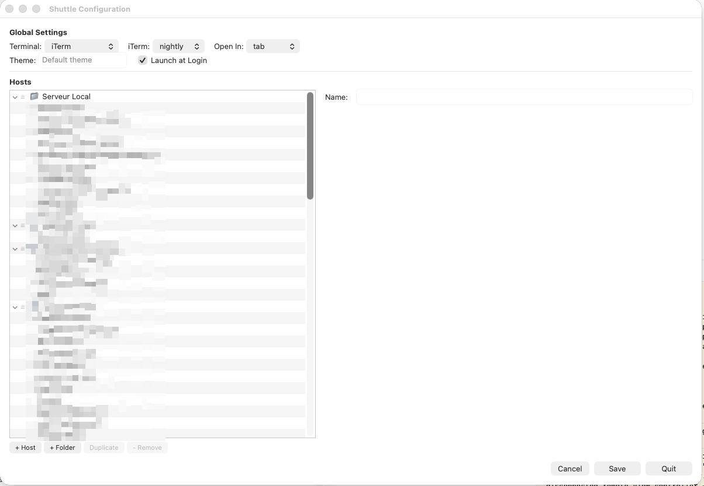

# Shuttle --> StarShip

[](https://gitter.im/fitztrev/shuttle?utm_source=badge&utm_medium=badge&utm_campaign=pr-badge&utm_content=badge)

A simple shortcut menu for macOS upgraded by HuguesMAX

[http://fitztrev.github.io/shuttle/](http://fitztrev.github.io/shuttle/)


## Built-in Configuration Editor

Shuttle now includes a visual configuration editor — no need to edit JSON by hand.

Open it from **Settings → Edit** in the Shuttle menu.



### Features

- **Global settings** — Terminal, iTerm version, open-in mode, default theme, launch at login
- **Hosts tree** — Outline view with folders and hosts, fully editable
- **Drag & drop** — Reorder hosts and move them between folders by dragging (grip handle ☰ shown on each row)
- **Duplicate** — Clone any host or folder (with all its children) in one click
- **Detail panel** — Edit name, command, theme, title, and terminal mode for the selected item
- **Save** — Writes changes to disk without closing the window, so you can keep editing
- **Cancel** — Discards unsaved changes by reloading the config from disk
- **Quit** — Closes the editor window

## Installation

1. Download [Shuttle](http://fitztrev.github.io/shuttle/)
2. Copy to Applications

## Building from Source (macOS)

### Prerequisites

| Dependency | Version | Notes |
|---|---|---|
| **macOS** | 10.9+ (target), 13+ recommended for building | Native Cocoa application |
| **Xcode** | 10.1+ (project format), 15+ recommended | Full IDE required (not just Command Line Tools) |
| **Apple Developer Account** | Free or paid | Required for code signing |

### System Frameworks (included with macOS/Xcode)

Shuttle uses only native Apple frameworks — no external dependencies or package managers:

- **Cocoa.framework** — Main UI framework (AppKit + Foundation + CoreData)
- **AppleScript** — Terminal automation (Terminal.app, iTerm2)

### Build Steps

1. **Install Xcode** from the Mac App Store

2. **Open the project**
   ```bash
   open Shuttle.xcodeproj
   ```

3. **Configure code signing**
   - In Xcode, select the **Shuttle** target
   - Go to **Signing & Capabilities**
   - Select your Team (personal or organization)
   - Xcode will manage the signing certificate automatically

4. **Build the application**
   - Press **⌘B** to build, or **⌘R** to build and run
   - The app appears in the menu bar (status bar icon, no Dock icon)

5. **Create a release archive** (optional)
   - Select **Product → Archive** (⌘⇧A) — requires the "Any Mac" destination
   - In the Organizer, click **Distribute App**

### Build from command line

```bash
# Build Debug
xcodebuild -project Shuttle.xcodeproj -target Shuttle -configuration Debug build

# Build Release
xcodebuild -project Shuttle.xcodeproj -target Shuttle -configuration Release build

# The .app bundle is generated in:
# build/Release/Shuttle.app  (or build/Debug/Shuttle.app)
```

### Recompile AppleScripts (optional)

Pre-compiled `.scpt` files are bundled. To recompile from source:

```bash
cd apple-scripts
./compile-Terminal.sh
./compile-iTermStable.sh
./compile-iTermNightly.sh
./compile-Virtual.sh
```

### macOS Permissions

After launching Shuttle, macOS will prompt for **Automation** access:
- Go to **System Settings → Privacy & Security → Automation**
- Allow Shuttle to control **Terminal.app** and/or **iTerm2**

## Help
See the [Wiki](https://github.com/fitztrev/shuttle/wiki) pages.

## Roadmap

* No Roadmap, if you need something, ask me.

## Contributors

This project was created by [Trevor Fitzgerald](https://github.com/fitztrev). I owe many thanks to the following people who have helped make Shuttle even better.

(In alphabetical order)

* [Alexis NIVON](https://github.com/anivon)
* [Alex Carter](https://github.com/blazeworx)
* [bihicheng](https://github.com/bihicheng)
* [Dave Eddy](https://github.com/bahamas10)
* [Dmitry Filimonov](https://github.com/petethepig)
* [Frank Enderle](https://github.com/fenderle)
* [Jack Weeden](https://github.com/jackbot)
* [Justin Swanson](https://github.com/geeksunny)
* [Kees Fransen](https://github.com/keesfransen)
* Marco Aurélio
* [Martin Grund](https://github.com/grundprinzip)
* [Matt Turner](https://github.com/thshdw)
* [Michael Davis](https://github.com/mpdavis)
* [Morton Fox](https://github.com/mortonfox)
* [Pluwen](https://github.com/pluwen)
* Rebecca Dominguez
* [Rui Rodrigues](https://github.com/rmrodrigues)
* [Ryan Cohen](https://github.com/imryan)
* [Stefan Jansen](https://github.com/steffex)
* Thomas Rosenstein
* [Thoro](https://github.com/Thoro)
* [Tibor Bödecs](https://github.com/tib)
* [welsonla](https://github.com/welsonla)

## Credits

Shuttle was inspired by [SSHMenu](http://sshmenu.sourceforge.net/), the GNOME applet for Linux.

I also looked to projects such as [MLBMenu](https://github.com/markolson/MLB-Menu) and [QuickSmileText](https://github.com/scturtle/QuickSmileText) for direction on building a Cocoa app for the status bar.
